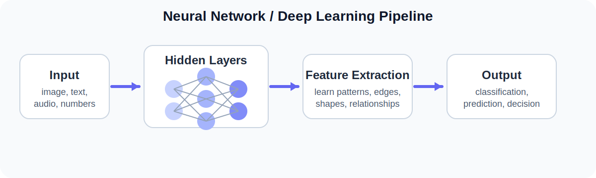
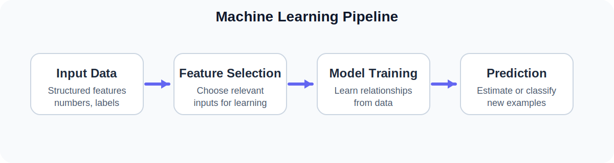
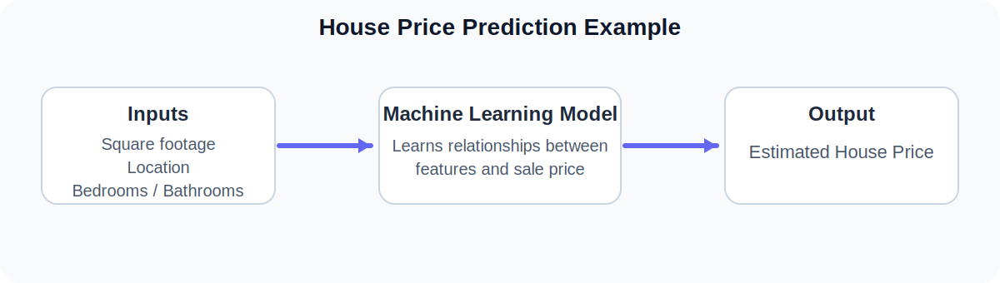
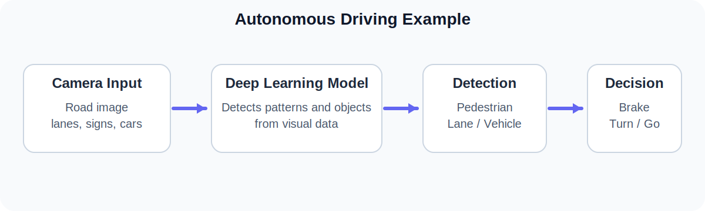
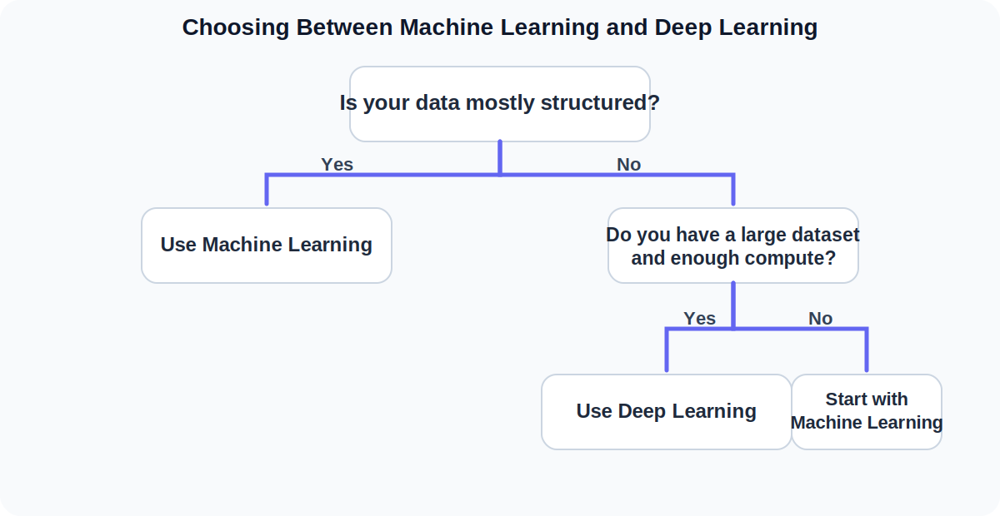

<a href="../../" class="back-btn">← Back to Portfolio</a>

# 🧠 Artifact 3: Deep Learning and Neural Networks

  <h2 style="margin-top:0;">Understanding AI Concepts Through Visual Explanation</h2>
  

    This artifact builds on my earlier machine learning work by focusing on neural networks, deep learning, and model selection.
    I wanted the page to match the clean card-based feel of my portfolio while using visuals and interactive sections to explain ideas more clearly.
  

  

    Neural Networks
    Deep Learning
    Model Selection
    Portfolio Artifact
  

## Why This Artifact Matters

  

    <h3>🧩 Simplifies Complexity</h3>
    
This page explains technical concepts in a way that feels clear, practical, and approachable.

  

  

    <h3>🎯 Supports Decision Making</h3>
    
It shows when machine learning works best and when deep learning is the stronger choice.

  

  

    <h3>🌍 Connects to Real Use Cases</h3>
    
Examples like house pricing and autonomous driving make the concepts easier to see and remember.

  

## A Simple Explanation of a Neural Network

  A neural network is a system that learns patterns from data. It takes in information, processes it through layers, and produces a prediction or decision.

  <h3 style="margin-top:0;">Deep Learning / Neural Network Flow</h3>
  

  
<strong>Input Layer</strong> Receives data such as numbers, text, or images.

  
<strong>Hidden Layers</strong> Detect patterns and relationships within the data.

  
<strong>Output Layer</strong> Produces a result such as a prediction, label, or recommendation.

## Machine Learning vs Deep Learning

<table class="compare-table">
  <thead>
    <tr>
      <th>Feature</th>
      <th>Machine Learning</th>
      <th>Deep Learning</th>
    </tr>
  </thead>
  <tbody>
    <tr>
      <td>Best for</td>
      <td>Structured data</td>
      <td>Images, speech, text, and other complex data</td>
    </tr>
    <tr>
      <td>Feature Engineering</td>
      <td>Usually manual</td>
      <td>Usually automatic</td>
    </tr>
    <tr>
      <td>Interpretability</td>
      <td>Higher</td>
      <td>Lower</td>
    </tr>
    <tr>
      <td>Data Requirements</td>
      <td>Works with smaller datasets</td>
      <td>Often needs larger datasets</td>
    </tr>
    <tr>
      <td>Complexity</td>
      <td>Lower</td>
      <td>Higher</td>
    </tr>
  </tbody>
</table>

  <h3 style="margin-top:0;">Machine Learning Flow</h3>
  

## Real-World Scenarios

  

    <h3 style="margin-top:0;">🏠 House Price Prediction</h3>
    
    

    
This scenario fits machine learning well because the data is structured and the goal is a direct prediction.

  

  

    <h3 style="margin-top:0;">🚗 Autonomous Driving</h3>
    
    

    
This scenario fits deep learning because the system must interpret images and make fast, complex decisions.

  

## Choosing the Right Approach

  <h3 style="margin-top:0;">Model Selection Decision Tree</h3>
  

## Click to Explore What I Learned

  
📘 Neural Networks

  

    I learned that neural networks become powerful because each layer helps the model recognize patterns at a deeper level.
    Instead of relying only on human-defined rules, the system learns from examples and improves through training.
  

  
📘 Deep Learning

  

    Deep learning is especially useful for unstructured data. It can automatically extract meaningful features from images, audio, and text, which makes it valuable for modern AI applications.
  

  
📘 Key Insight

  

    My biggest takeaway is that understanding AI is not just about defining terms. It is about explaining concepts simply, selecting the right method, and connecting technical ideas to real-world use.
  

## Tools and Technologies Used

- GitHub Pages
- Markdown with embedded HTML/CSS
- SVG diagrams for visual explanation
- ChatGPT for brainstorming, structure, and clarity support

