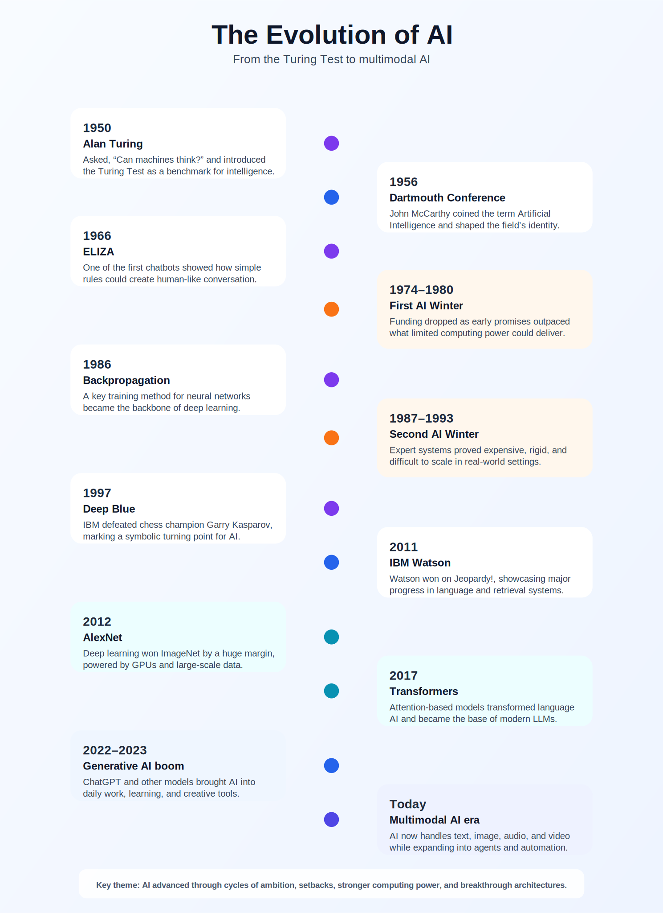

<a href="../../" class="back-btn">← Back to Portfolio</a>

# Artifact 4: 🧠 The Evolution of AI

  

    Interactive AI Timeline
    

      Explore how artificial intelligence evolved from early rule-based systems 
      into deep learning, transformers, and today’s multimodal AI.
        
      👉 Click image to view AI timeline
    

  

  

    
  

---

## 🧭 Explore the Timeline

  

  
1950

  
1956

  
1966

  
1986

  
1997

  
2011

  
2012

  
2017

  
2022

  
Click a year to see what happened.

---

  
✨ What stands out from AI history

  

    <ul>
      <li>AI evolved through cycles of hype and setbacks</li>
      <li>Breakthroughs often followed improvements in computing power</li>
      <li>Modern AI is built on decades of foundational research</li>
    </ul>
  

---

  
💡 Why I included this in my portfolio

  

    

      I included this artifact to show AI as a long-term evolution rather than a sudden trend. 
      Looking at the timeline makes it easier to understand how today’s tools were shaped by 
      decades of experimentation, setbacks, and breakthroughs.
    

  

---

<!-- MODAL -->

  &times;
  

---

