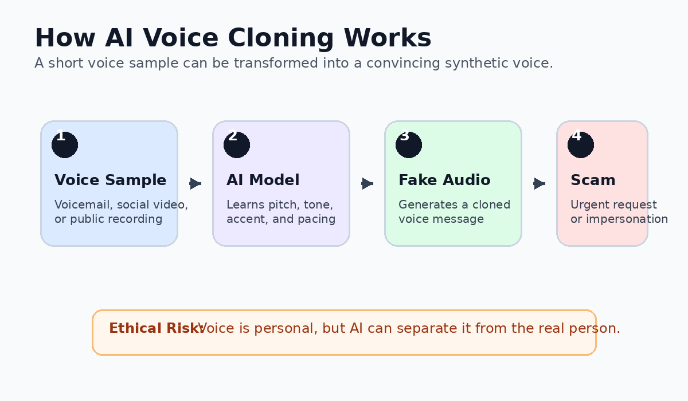
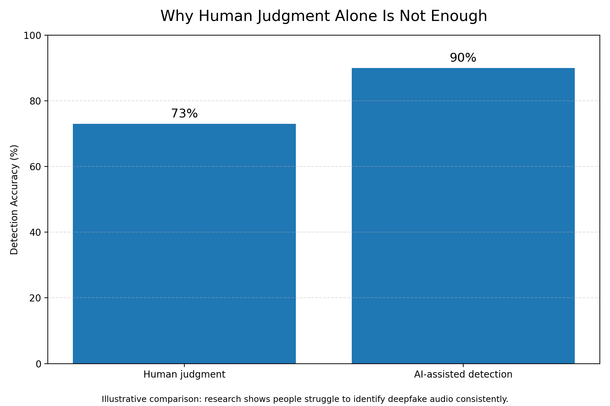

<a href="../../" class="back-btn">← Back to Portfolio</a>

# 🧠 AI Ethics: Deepfake Voice Scams  
### Trust, Identity, and Risk in AI Systems

---

## 🔍 Introduction

Artificial intelligence is rapidly transforming how we communicate, but it is also creating new ethical risks. One major concern is the rise of **AI voice deepfake scams**, where scammers use AI to replicate voices and manipulate victims into sending money or sharing sensitive information.

This artifact explores how this technology challenges trust, identity, and human judgment.

---

## 📖 Description

This artifact analyzes AI voice deepfake scams through three key ethical issues:

- Identity theft and misuse of personal data  
- Misinformation and manipulation  
- Limitations of human judgment in detecting fake audio  

It highlights that this is not just a technical issue, but a human-centered problem involving trust and behavior.

---

## 🎯 Objective

- Understand ethical risks of AI voice cloning  
- Analyze impact on trust and decision-making  
- Explore mitigation strategies  

---

## 📊 Visual Overview

*Figure 1. AI voice deepfake scams are increasing as voice cloning becomes more accessible.*

---

## ⚙️ Process

### 🔐 Step 1: Identity Theft

Voice cloning allows attackers to recreate a person’s voice using short audio samples.

<strong>Select to reveal insight</strong>

Voice is a trusted form of identity. When AI can replicate it, traditional verification methods become unreliable.

---

### 🧩 Step 2: Misinformation

Deepfake audio spreads quickly because it sounds real and familiar.

<strong>Select to reveal insight</strong>

People are more likely to trust audio than text, making misinformation harder to detect.

---

### ⚠️ Step 3: Detection Gap

Humans are not as effective at detecting deepfake audio as expected.

<strong>Select to reveal insight</strong>

AI-assisted detection tools are needed to support human judgment.

---

## 🛠 Tools and Technologies Used

- Machine Learning  
- Natural Language Processing  
- Voice Cloning Models  
- Deepfake Detection Systems  

---

## 💡 Value Proposition

This artifact demonstrates how AI can disrupt trust and create new security risks. It provides a clear, visual explanation of a real-world problem and highlights the need for better safeguards.

---

## ✨ Unique Value

This work stands out by combining:
- Technical understanding of AI systems  
- Human-centered ethical analysis  
- Visual storytelling to explain complex concepts  

---

## 🌍 Relevance

This topic is important for:
- Cybersecurity  
- AI governance  
- Business risk management  
- Digital identity systems  

*Figure 2. AI voice deepfakes impact fraud, trust, and security.*

---

## 🧠 Reflection

<strong>Select to reveal reflection</strong>

At first, I saw deepfake scams as mainly a technical issue. However, this analysis showed that the real challenge lies in trust, human behavior, and misuse.

One assumption I had was that better AI always leads to better outcomes. I now understand that without safeguards, AI can introduce new risks.

Going forward, I will consider both functionality and potential misuse when working with AI systems.

---

## 📚 References

McAfee. *A Guide to Deepfake Scams and AI Voice Spoofing.*  
https://www.mcafee.com/learn/a-guide-to-deepfake-scams-and-ai-voice-spoofing/  

Zhang, B., Cui, H., Nguyen, V., & Whitty, M. (2025).  
*Audio Deepfake Detection: What Has Been Achieved and What Lies Ahead.*  
https://doi.org/10.3390/s25071989  

---
